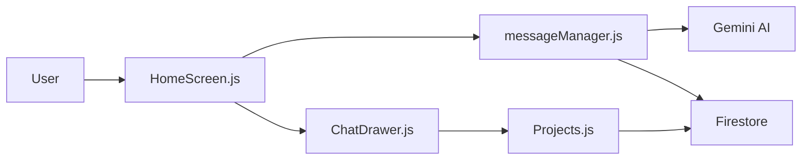

# Study All in GPT - Comprehensive Documentation

Welcome to Study All in GPT! This guide will walk you through everything you need to know about our educational AI-powered application. Whether you're a beginner developer or just getting started with the project, we've got you covered with detailed explanations and step-by-step instructions.

## Project Overview
A full-stack application featuring AI-powered chat, Firebase integration, and project management capabilities built with React Native.

### Application Flow
1. **User Authentication** 
   - Login/Register → Firebase Auth → Session Cookie
2. **Main Chat Interface**
   - Message Input → Sanitization → Gemini API → Response Streaming
3. **Project Management**
   - Task Creation → Firestore Update → Real-time Sync
4. **Data Flow**
   ```mermaid
   graph TD
   A[User] --> B[React Native App]
   B --> C{Authentication}
   C -->|Success| D[Chat Interface]
   D --> E[Message Manager]
   E --> F[Gemini 1.5 Flash]
   D --> G[Project Manager]
   G --> H[Firestore DB]
   ```

### Key Features

**Beginner-Friendly Explanation**
Our app works like a smart study buddy that:
1. Remembers last 5 conversations
2. Checks messages for safety
3. Streams responses in real-time
4. Connects to your projects

- **AI Chat System**
  - Gemini 1.5 Flash model integration
  - Message sanitization and error handling
  - Context management (5 message history)
  - Abort controller support for streaming

- **Firebase Services**
  - Authentication with platform-specific persistence
  - Firestore for user data/metadata
  - Storage integration
  - Real-time message tracking

- **Project Management**
  - Task organization system
  - User permission levels
  - Progress tracking

## Development Setup

**First-Time Setup Guide**
1. Install [Android Studio](https://developer.android.com/studio)
2. Enable USB Debugging on your phone
3. Run `adb devices` to verify connection
4. Use VS Code with React Native extension


*Basic development environment setup*

### Prerequisites
- Node.js v18+
- npm v9+
- Firebase project
- Google Gemini API key

### Installation
```bash
npx react-native init MyFirstApp
cd MyFirstApp
npm install @google/generative-ai firebase @react-native-async-storage/async-storage
```

### Configuration
1. Create `.env` file:
```ini
FIREBASE_API_KEY=your_key
FIREBASE_AUTH_DOMAIN=your_domain
GEMINI_API_KEY=your_key
```

2. Update Firebase config (`firebase.js`):
```javascript
const firebaseConfig = {
  apiKey: process.env.FIREBASE_API_KEY,
  // ... other config values
};
```

3. Configure AI service (`services/ai.js`):
```javascript
const API_KEY = process.env.GEMINI_API_KEY;
```

## Architecture

**Component Map Explained**


**Beginner's Guide to Components**:
1. `HomeScreen.js` - Main chat window (like your messaging app)
2. `messageManager.js` - Message traffic controller (post office for chats)
3. `ai.js` - Brain of the AI (converts questions to answers)
4. `ChatDrawer.js` - Side menu (app navigation hub)

```
├── services/
│   ├── ai.js              - Gemini API wrapper (AI Brain)
│   ├── messageManager.js  - Firestore message tracking (Message Post Office)
│   ├── accessControl.js   - Permission management (Security Guard)
├── screens/
│   ├── HomeScreen.js      - Main chat interface (Digital Notebook)
│   ├── Projects.js       - Project management (Task Whiteboard)
│   ├── Analytics.js       - Usage statistics (Progress Report Card)
├── components/
│   ├── ChatDrawer.js      - Navigation panel (App Control Center)
│   ├── CodeBlock.js       - Syntax-highlighted code (Code Highlighter)
├── firebase.js            - Firebase configuration (Cloud Connection)
└── models/
    └── JournalEntry.js    - Data structure (Memory Blueprint)
```

## API Integration Guide

### Firebase Requirements
1. Enable Email/Password authentication
2. Create Firestore database in test mode
3. Set up storage bucket

### Gemini API Setup
1. Enable Generative Language API
2. Create API key in Google Cloud Console

## Running the Application

**Common Issues Solutions**
```
🔥 Firebase Error: Missing Index
1. Go to Firestore Console
2. Click 'Create Index' button
3. Use fields from error message
4. Wait 2-5 minutes for indexing

💡 Pro Tip: Run `firebase emulators:start`
for local development without cloud costs
```

**Error Handling Strategy**
1. Input Validation → 400 Bad Request
2. API Retry → 3 attempts with 2s delay
3. Fallback Cache → Show last working response
4. Error Logging → Firebase Crashlytics

### Development Mode
```bash
npm start
npm run android
```

### Production Build
```bash
npm run build:android
```

## Contributing
1. Follow Git Flow workflow
2. Write Jest unit tests for new features
3. Document API changes in `/docs`
4. Submit PR with:
   - Test coverage report
   - Updated TypeScript definitions
   - Migration guide if breaking changes

## License
MIT License - See [LICENSE.md](LICENSE.md)